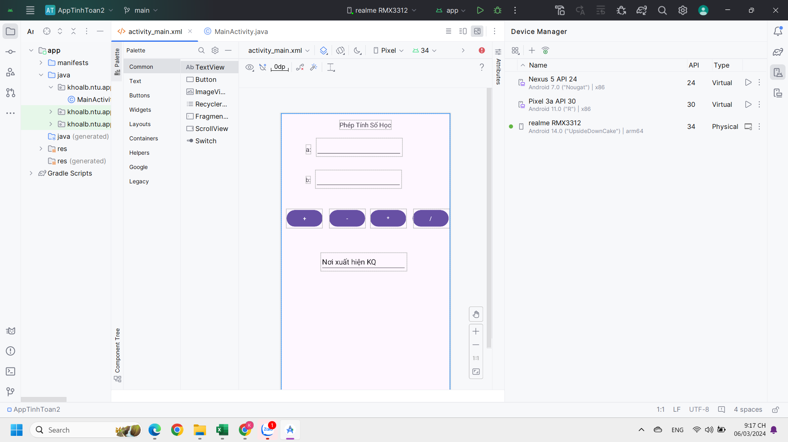

# Cùng Học Lập Trình Android

Chào mừng bạn đến với cuộc hành trình sáng tạo trong thế giới phát triển ứng dụng Android! Bạn đã sẵn sàng khám phá và tạo ra những ứng dụng độc đáo và thú vị chưa? Dưới đây là một hướng dẫn ngắn gọn, đầy màu sắc và hứng khởi để bắt đầu!

## Khởi Đầu

Trước hết, để bắt đầu cuộc phiêu lưu Android của bạn, hãy chắc chắn rằng bạn đã có môi trường phát triển sẵn sàng:

1. **Cài Đặt Android Studio**: Đây chính là lò nấu ẩm của những ý tưởng sáng tạo. Tải và cài đặt [Android Studio](https://developer.android.com/studio) ngay từ trang web chính thức.

2. **Set Up Android SDK**: Android Studio sẽ hỏi bạn cài đặt các thành phần SDK cần thiết trong quá trình cài đặt. Đảm bảo rằng bạn đã cài đặt các phiên bản SDK phù hợp cho các phiên bản Android mà bạn muốn hướng đến.

3. **Tạo Dự Án Mới**: Mở Android Studio và bắt đầu cuộc hành trình mới với dự án của bạn. Theo dõi các bước trong hướng dẫn để thiết lập dự án với các thiết lập và cấu hình mong muốn.
4. **Tôi Đã Kết Nối Với ĐT/Pair Devices Using WIFI With My Phone**: Tôi đã cố gắng kết nối điện thoại của mình để có thể hiện thị App mà mình lập trình và thành công.

## Khám Phá Các Thành Phần Quan Trọng

Trong hành trình của bạn, bạn sẽ gặp phải những thành phần thú vị sau:

- **Activities**: Như những trang sách mở ra, các Activities là nơi bạn thiết kế giao diện người dùng của ứng dụng.

- **Fragments**: Đây giống như những viên gạch LEGO, cho phép bạn xây dựng giao diện người dùng một cách linh hoạt và dễ dàng.

- **Layouts**: Layouts là những bản thiết kế đồ họa của ứng dụng, giúp bạn sắp xếp và trang trí giao diện theo ý muốn.

- **Views**: Views là các thành phần như nút, ô văn bản hay hình ảnh, biến ứng dụng của bạn thành một không gian tương tác và sống động.

## Thực Hiện Ý Tưởng Của Bạn

Bây giờ, là lúc để ý tưởng của bạn trở thành hiện thực. Hãy thực hiện những ý tưởng táo bạo và độc đáo của bạn và khám phá những tính năng đặc biệt như:

- **Tối Ưu Hóa Hiệu Năng**: Làm cho ứng dụng của bạn chạy mượt mà và nhanh chóng như một siêu xe với các kỹ thuật tối ưu hiệu suất.

- **Kết Nối Thông Minh**: Sử dụng Intents để kết nối các thành phần của ứng dụng của bạn một cách thông minh và hiệu quả.

- **Tùy Biến Giao Diện**: Thực hiện giao diện người dùng độc đáo và thú vị bằng cách sử dụng Material Design và các yếu tố tùy chỉnh.

## Tiếp Tục Khám Phá

Không có hạn chế cho sự sáng tạo của bạn trong lập trình Android! Đừng ngần ngại tiếp tục khám phá và học hỏi thông qua các tài liệu, diễn đàn, và cộng đồng phát triển.

## Tài Liệu Tham Khảo

Tìm kiếm sự hỗ trợ từ các nguồn tài nguyên phong phú dưới đây:

- [Tài Liệu Chính Thức của Nhà Phát Triển Android](https://developer.android.com/docs)
- [Hướng Dẫn Lập Trình Android của CodePath](https://guides.codepath.com/android)
- [Kênh YouTube của Nhà Phát Triển Android](https://www.youtube.com/user/androiddevelopers)

## Kết Luận

Hãy bắt đầu hành trình của bạn với tinh thần sáng tạo và khám phá vô tận! Android là một thế giới đầy màu sắc và tiềm năng, chờ đợi để bạn khám phá và tạo ra những điều kỳ diệu. Chúc bạn có một cuộc hành trình lập trình Android thú vị và thành công! 🚀
